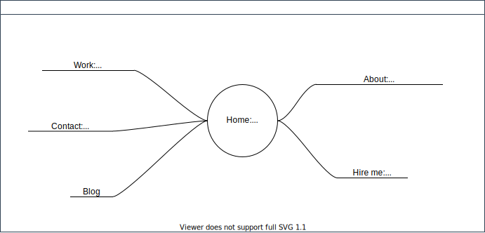

## General considerations

I like when a blog or a website has interesting content and visuals do not provocate. I feel distracted when I see fancy animations, stimulating colors, 3D, sophisticated design. Like I'm in a race or something. As a person, I value growth, not competition. There is no winner here. We can all grow and it will lead to a better future for everyone.

I want to engage people to read when they stop by to see my website. I want them to feel that they are taken care of, with details that account for a smooth experience. I don't want them to compare, and to feel bad (or good) about their personal site. 

No hierarchical feel. Focus on what I *can do* and what I *did* with only a slight mention of courses taken.
I am a fellow human that is amazed by technology.

I want to communicate *ideas*, and not to bargain my place in some *hierarchy*.

## Plan

## Language

English only. I don't want to work in French-speaking world, and those who speak Dutch generally have great command of English. So, focusing on Dutch and English community, English version is more than enough for the first iteration of my website. 

## Theming

I have no color preference: with every color it is possible to do something disgusting. So, for me it's more a matter of quality. I'll go with *some* color and focus on quality, because if I'll do that in a smart way, adding theming feature will then be a bliss.

## Do's and dont's

__Yes:__
* Visual calmness
* No client side JavaScript
* Performance
* Accessibility
* Responsiveness
* SEO friendly

__No:__
* Wow-things (big things, moving things, colorful things)

## Goal

Seamless experience:
- no unstyled content on load
- no distracting things
- quality and honesty in writing

## Good-to-have: goals for next iterations

For now I focus on critical features to build minimal version of the website. 
Later:
- webmentions
- theming
- internationalization
- embeds
- continious improvement of sass, image, font pipeline 

## References

Here are several websites that give that feel I aim at reaching.

### Main:
1. Andy Bell
https://andy-bell.co.uk/
Clean, minimal quality design.

2. Max Böck
https://mxb.dev/
Feature-rich; thing to take notes for long-term.

### Secondary:

3. Ryan Mulligan
https://ryanmulligan.dev/
- All info in short on home page: no overloaded navbar: very light and professional feel
- CodePen horizontal scroll

4. Josh Comeau
https://www.joshwcomeau.com/
Quality content and lots of hidden Easter eggs.

5. Monica Dinculescu
https://meowni.ca/
Clean and creative. Concise and playful writing.
 
### Inspiration/off the chart: 
- It's Nice That...
https://www.itsnicethat.com/

- Food 
https://www.food.xyz/

These websites keep me revisiting them often because of their textual content and non-distracting visuals.

